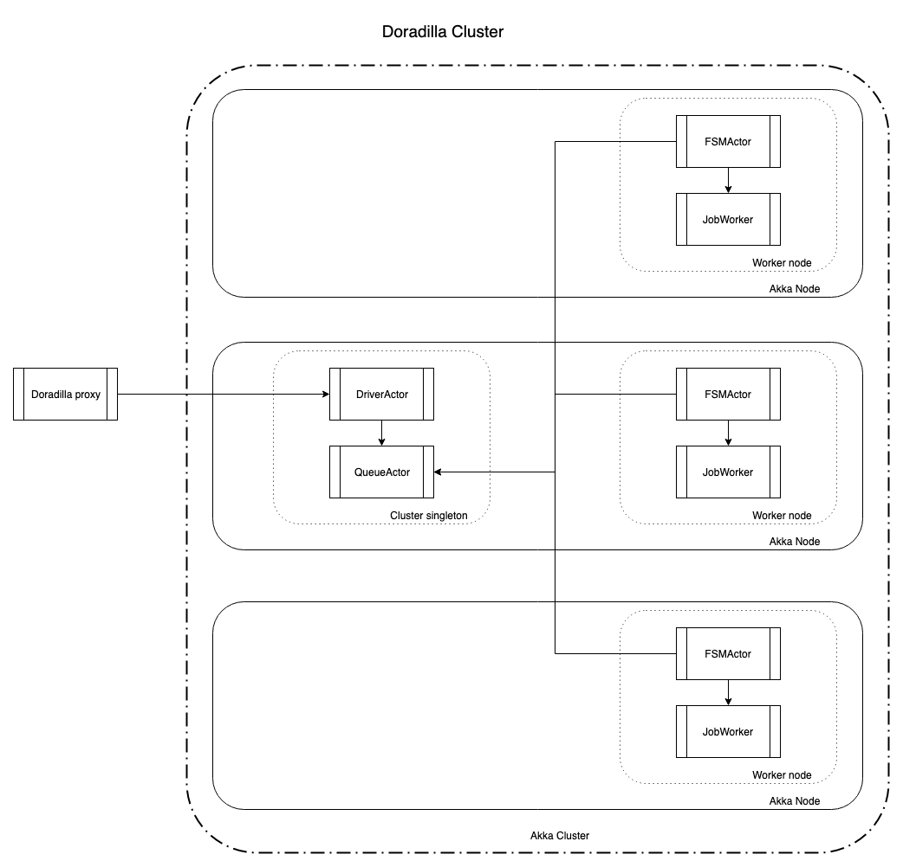

Doradilla
===========================

[](https://travis-ci.org/wherby/doradilla)[](https://codecov.io/github/wherby/doradilla?branch=master)


Doradilla-core is a job manage system.
Doradilla is a distributed system which is based on Akka cluster.

### Doradilla-Core

Doradilla-core is a job manage system which will handle the job request in reactive way.


#### Message flow


See detail: [doradilla-core](/docs/doradilla-core/doradilla-core.md)

### Doradilla 

Doradilla provides distributed running environment which is based on Akka cluster. With same configuration as Akka cluster, Doradilla-core will running on Akka cluster node.




### How to use

### How to run a process job

1.Run process job and get synchronize result:

```Scala
  "Baeckend server " should "start and run command " in {
    val backendServer = BackendServer.startup(Some(1600))
    backendServer.registFSMActor()
    val msg = TestVars.processCallMsgTest
    val processJob = JobMsg("SimpleProcess", msg)
    val res = BackendServer.runProcessCommand(processJob).map {
      res =>
        println(res)
        assert(true)
    }
    Await.ready(res, ConstVars.timeout1S * 10)
  }
```

2.Run process job and query result:

``` Scala
  "Run process Command " should  "start the command and qurey result " in {
    val backendServer = BackendServer.startup(Some(1600))
    backendServer.registFSMActor()
    val msg = TestVars.processCallMsgTest
    val processJob = JobMsg("SimpleProcess", msg)
    val receiveActor = BackendServer.startProcessCommand(processJob).get
    BackendServer.queryProcessResult(receiveActor).map {
      resultOpt =>
        assert(resultOpt == None)
    }
    Thread.sleep(2000)
    val res = BackendServer.queryProcessResult(receiveActor).map {
      resultOpt =>
        assert(resultOpt != None)
    }
    Await.ready(res, ConstVars.timeout1S)
  }
```

### For use defined implementation of reflection. 

User should defined their implementation of reflection, more information see [ProcessService](./docs/doradilla-core/util/ProcessService.md)