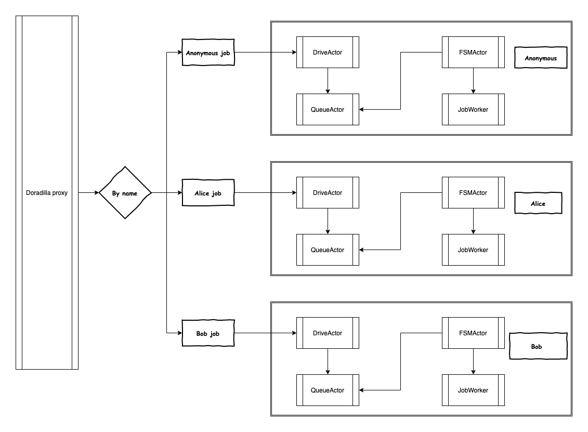

# Named job

## What's named job

By default doradilla will create a cluster based JobApi to process anonymous job at initialization stage.

When received a named job, the doradilla will create a named JobApi to handled the job.

The code implementation see [Named job Runner](https://github.com/wherby/doradilla/blob/master/doradilla-core/src/main/scala/doradilla/back/NamedJobRunner.scala):

@@ snip [Named job runner](code/namedjob.scala)

## Usage

@@ snip [named job usage](/doradilla-core/src/test/scala/app/NamedJobRunnerSpec.scala)